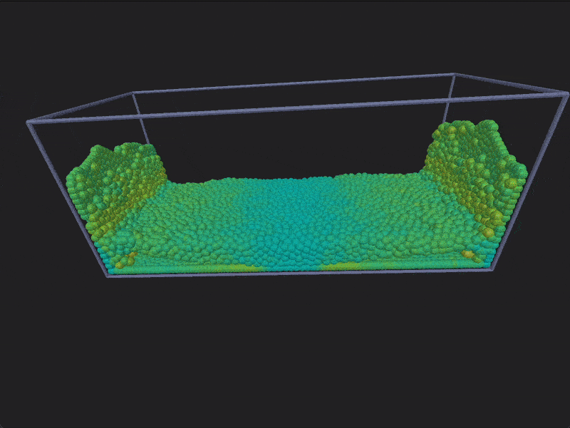

# Drizzle

Drizzle is a small fluid simulator written in C++ inspired by [Sebastian Lague's](https://www.youtube.com/watch?v=rSKMYc1CQHE) fluid simulator video. It uses Smooth Particle Hydrodynamics (SPH) to simulate the fluid behaviour, and is meant to be simple and performance oriented. It features both 2D and 3D simulations.

This project is also a little bit of a testbed for me to try some libraries I am developing, such as [Toolkit](https://github.com/ismawno/toolkit), [Vulkit](https://github.com/ismawno/vulkit) or [Onyx](https://github.com/ismawno/onyx), to see how they perform in a real project, and features such as SIMD or GPGPU that I plan to add eventually. It will also serve as a warm-up for a full physics engine I plan to develop in the future.

  
  &nbsp;&nbsp;
  

## Pending features

The following is a small list of features I would like to add in the future:
- **Additional fluid behaviours**: such as viscoelasticity, plasticity, stickiness, etc.
- **SIMD optimizations**: to improve performance on modern CPUs.
- **Compute shaders support**: to offload some of the calculations to the GPU.

## Dependencies and Third-Party Libraries

Drizzle relies on several dependencies for platform-independent windowing, graphics APIs, and ImGui support:

- [toolkit](https://github.com/ismawno/toolkit): A utility library I have developed.

- [vulkit](https://github.com/ismawno/vulkit): A Vulkan library I have developed.

- [onyx](https://github.com/ismawno/onyx): An application framework library I have developed.

- [argparse](https://github.com/p-ranav/argparse): Command line argument parser library.

## Installation and building

I have tried to make the setup process as straightforward as possible. I have provided some installation scripts for Windows, MacOS and Linux under the [setup](https://github.com/ismawno/drizzle/tree/main/setup) folder. The scripts will install all the dependencies and build the project for you (which you can also build manually with `CMake` if you prefer).

**Important note:** To use the installation scripts, `python` is required to be installed in your system. It should be the only manual dependency you need to install.

### Windows

Double click on the [win-install.bat](https://github.com/ismawno/drizzle/blob/main/setup/win-install.bat) script to begin installation. All missing required dependencies, if desired by the user, will be installed automatically. `CMake` will also run automatically after the installation.

Once the process completes successfully, you will find the `build` folder in the root of the project. There, under the `drizzle` folder, you may open the `Visual Studio` solution to compile and run the project.

### Unix systems

Execute the `bash` script [unix-install.sh](https://github.com/ismawno/drizzle/blob/main/setup/unix-install.sh) to begin installation. All missing required dependencies, if desired by the user, will be installed automatically. `CMake` and `make` (which is the generator used) will also run automatically after the installation.

**On MacOS:** Execute the script without administrative privileges: `./unix-install.sh`.
**On Linux:** Execute the script with administrative privileges: `sudo ./unix-install.sh`.

Once the process completes successfully, you will find the `build` folder in the root of the project. There, under the `drizzle` folder, you may run the project executable.

**Note:** The installation script is completely untested on Linux, as I don't have a Linux machine. It should be safe to execute however as the installer will ask the user every time it attempts to execute a command.

## Uninstallation

As the installation scripts may add some required system wide dependencies, I have also provided an uninstaller to remove any dependencies that were installed by the installation scripts. The uninstaller will not remove any dependencies that were already installed in your system, so you can safely run it without worrying about breaking anything.

Once the uninstallation completes successfully, you may remove the repository folder if you wish.

### Windows

Double click on the [win-uninstall.bat](https://github.com/ismawno/drizzle/blob/main/setup/win-uninstall.bat) script to begin uninstallation. All the dependencies that were explicitly installed by [win-install.bat](https://github.com/ismawno/drizzle/blob/main/setup/win-install.bat) will be removed.

### Unix systems

Execute the `bash` script [unix-uninstall.sh](https://github.com/ismawno/drizzle/blob/main/setup/unix-uninstall.sh) to begin uninstallation. All the dependencies that were explicitly installed by [unix-install.sh](https://github.com/ismawno/drizzle/blob/main/setup/unix-install.sh) will be removed.

## Versioning

As some Drizzle dependencies are being developed by me and are under constant change, I can only guarantee this project will build from the `main` branch or a specific tagged commit. This is because such dependencies are fetched with `CMake`'s `FetchContent` module with the `GIT_TAG` parameter set to `main` for all commits except for tagged ones. This makes my life easier when it comes to updating the dependencies according to my needs.