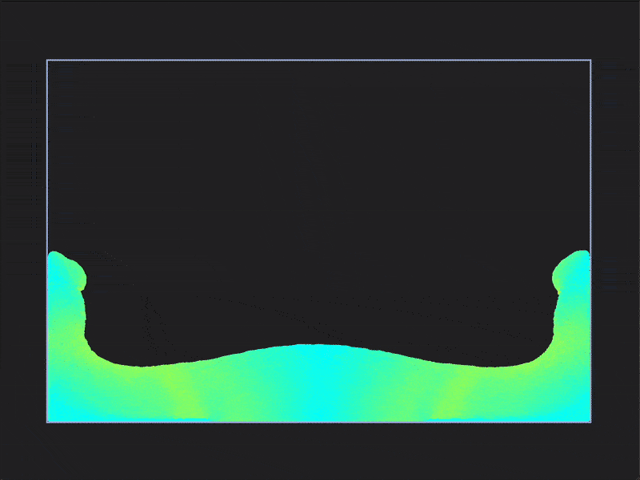

# Drizzle

Drizzle is a small fluid simulator written in C++ inspired by [Sebastian Lague's](https://www.youtube.com/watch?v=rSKMYc1CQHE) fluid simulator video. It uses Smooth Particle Hydrodynamics (SPH) to simulate the fluid behaviour, and is meant to be simple and performance oriented. It features both 2D and 3D simulations.

This project is also a little bit of a testbed for me to try some libraries I am developing, such as [toolkit](https://github.com/ismawno/toolkit), [vulkit](https://github.com/ismawno/vulkit) or [onyx](https://github.com/ismawno/onyx), to see how they perform in a real project, and features such as SIMD or GPGPU that I plan to add eventually. It will also serve as a warm-up for a full physics engine I plan to develop in the future.

<p align="center">
  
  &nbsp;&nbsp;
  
</p>


## Pending features

The following is a small list of features I would like to add in the future:
- **Additional fluid behaviours**: such as viscoelasticity, plasticity, stickiness, etc.
- **SIMD optimizations**: to improve performance on modern CPUs.
- **Compute shaders support**: to offload some of the calculations to the GPU.

## Dependencies and Third-Party Libraries

Drizzle relies on some dependencies such as [toolkit](https://github.com/ismawno/toolkit), [vulkit](https://github.com/ismawno/vulkit) and [onyx](https://github.com/ismawno/onyx). Most of them are pulled automatically from `CMake`.

## Building

The building process is straightforward. Using `CMake`:

```sh
cmake --preset release
cmake --build --preset release
```

